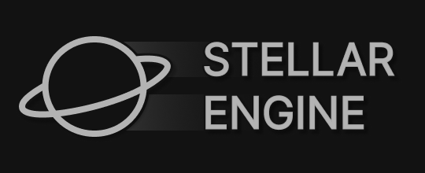

# Stellar Engine

    

 

# What is Stellar Engine?

An **open-source** game/rendering engine, which aims to provide users with an all-in-one development kit, suited for any graphics-intesive tasks (such as video games, 3D editors, etc.). It is based solely on the **[Vulkan](https://www.vulkan.org/)** rendering API, which provides suppot for **Windows 7-11**, **Linux**, and **[more](https://en.wikipedia.org/wiki/Vulkan#Cross_platform)** to further improve its already-incredible performance

 
